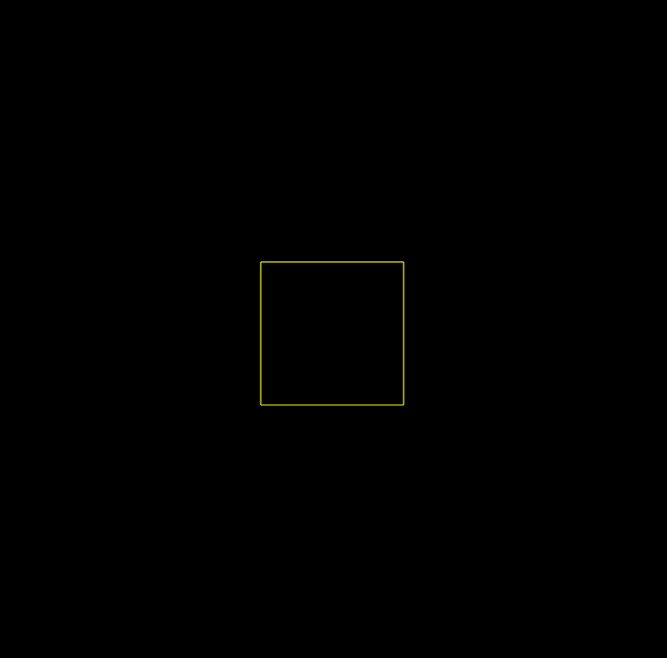

# Laser DAC Tutorials

This is the tutorial of [Laser DAC](https://github.com/Volst/laser-dac), including API reference and some examples.

## Installation

Laser DAC is a node package, and use yarn as the package manager. At first, you should make sure that install both of node and yarn correctly in your computer.

- [node](https://nodejs.org/en/download/)
- [yarn](https://yarnpkg.com/getting-started/install)

## Get started

It is very easy to get started:

- **Clone this repository**: Find or create an empty folder and open the terminal run `git clone https://github.com/ofcourseio/laser-dac-tutorials.git`. Change directory `cd laser-dac-tutorials`
- **Install dependcies**: Run `yarn install`.
- **Run demo on a simulator**: Run `yarn run dev`, and open your browser with`http://localhost:8080`.
- **Run demo on the connected device**: Change the content of `src/config.,s` as follows, then run `yarn run dev`.
  
```js
import { EtherDream } from "@laser-dac/ether-dream";

export default {
  Device: EtherDream,
};
```

If everything goes right, it looks like as below:



If your want to build your project, just run `yarn run build`. After building, run `yarn run start`.

## Introduction

### Structure

The basic structure of Laser DAC program is separated into three parts:

- Create DAC and connect it to selected device.
- Create a new scence and stream the data it to selected device.
- Update scene.

```js
import { DAC } from "@laser-dac/core";
import { /* Device */ } from "@laser-dac/xxx"
import { Scene } from "@laser-dac/draw";

(async () => {
  // Create DAC and connect it to selected device
  const dac = new DAC();
  dac.use(/* selected device */);
  await dac.start();

  // Create a new scence and stream it to selected device
  const scene = new Scene({
    resolution: /* custom resolution which default to 500*/,
  });
  scene.start(step);
  dac.stream(scene);

  // Update scene
  function step() {
    /**
     * creative coding area.
     * **/
  }
})();
```
### Add shape to screen

Each time your want to add a shape to screen, just create the object and call `scene.add(obj)`.

```js
import { Rect } from "@laser-dac/draw";

const rect = new Rect({
  width: 0.2,
  height: 0.2,
  x: 0.4,
  y: 0.4,
  color: [1, 1, 0],
});

scene.add(rect);
```

## API

### DAC

- `Object DAC()`
- `void use(Device Object)`
- `Promise start()`
- `void stream(Scene Object)`
  
### Device

- `Object EtherDream()`
- `Object Helios()`
- `Object Laserdock()`
- `Object Beyond()`
- `Object Easylase()`
- `Object Simulator()`
  
### Shape

- `Object Scene(options)`
- `Object Shape(options)`
- `Object Rect(options)`
- `Object Line(options)`
- `Object Circle(options)`
- `Object Point(options)`
- `Object Path(options)`
- `Object Svg(options)`
- `Object Wait(options)`
- `Object QuadCurve(options)`
- `Object CubicCurve(options)`
- `Object HersheyFont(options)`
- `Object Ilda(options)`
- `Object helpers(options)`